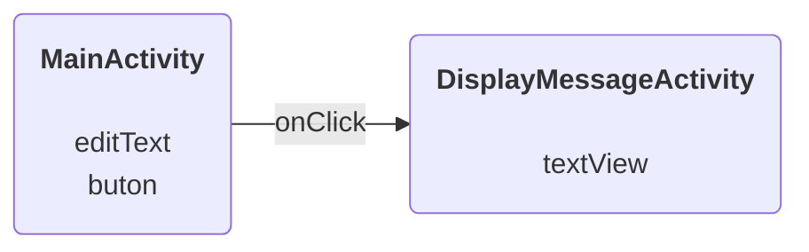

# Spotkanie 1 - Podstawy

Cel ćwiczeń to zbudowanie 2 "ekranów", w jednym wprowadzamy tekst, a w drugim -- po naciśnięciu przycisku -- wyświetlamy wprowadzony tekst:

Instrukcje:

- [lab 1](lab1.pdf)
- [lab 2](lab2.pdf)

## Design

- [figma](https://www.figma.com/)
- [invisionapp](https://www.invisionapp.com)
- [Sketch App](https://www.sketch.com/)
- low-fidelity wireframing:
  - https://pencil.evolus.vn
  - https://balsamiq.com
